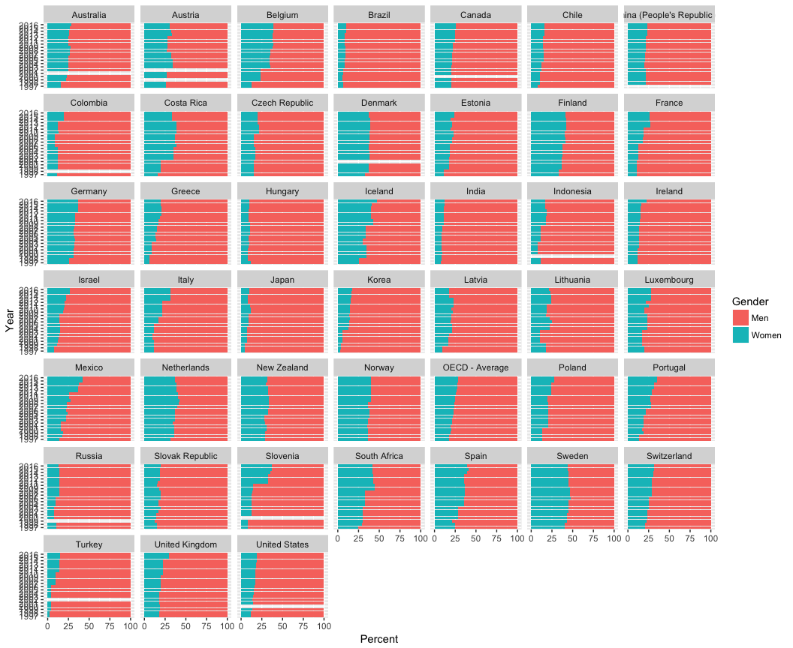
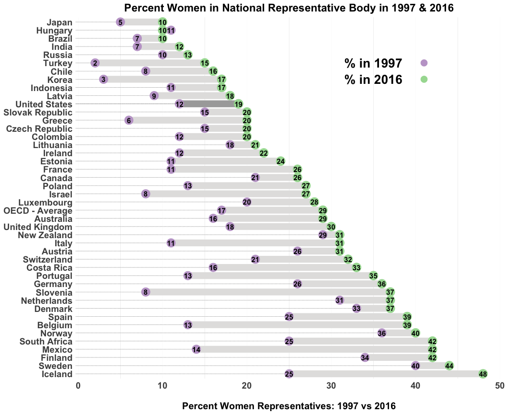

WomenInParliament
================
Jenny
12/20/2017

Load packages used.

``` r
##library(tidyverse)
library(data.table)
library(ggplot2)
library(plyr)
library(tidyr)
library(dplyr)
```

    ## 
    ## Attaching package: 'dplyr'

    ## The following objects are masked from 'package:plyr':
    ## 
    ##     arrange, count, desc, failwith, id, mutate, rename, summarise,
    ##     summarize

    ## The following objects are masked from 'package:data.table':
    ## 
    ##     between, first, last

    ## The following objects are masked from 'package:stats':
    ## 
    ##     filter, lag

    ## The following objects are masked from 'package:base':
    ## 
    ##     intersect, setdiff, setequal, union

``` r
library(magrittr)
```

    ## 
    ## Attaching package: 'magrittr'

    ## The following object is masked from 'package:tidyr':
    ## 
    ##     extract

``` r
library(ggalt)
```

Load data downloaded from OECD with Female/Male share of seats in national parliaments. OECD API does not include access to all data sets.

<http://stats.oecd.org/index.aspx?queryid=54754#>

``` r
women_repping <- read.csv("women_repping_worldwide.csv", header = TRUE)
```

Add Men and Percent Men as additional variables, then gather with Women and Value. Remove unneeded columns.

Make separate dataframe with only 1997 & 2016 Women data for a dumbell plot.

``` r
cols <- c("Year", "Gender")

women_repping <- women_repping %>%
        rename(Women = Value) %>%
        rename(Year = Time) %>%
        mutate(Men = 100-Women) %>%
        gather(key = Gender, value = Percent, Women, Men) %>%
        .[,c(1,2,10,19,20)] %>%
        mutate_at(cols, funs(factor(.)))

womenrep97_16 <- subset(women_repping, Year %in% c("1997", "2016") & Gender == "Women") %>%
        spread(Year, Percent) %>%
        rename(y_1997 = `1997`) %>%
        rename(y_2016 = `2016`) %>%
        mutate(y_2016 = round(y_2016, 0)) %>%
        mutate(y_1997 = round(y_1997, 0)) %>%
        subset(Country != "China (People's Republic of)")
```

Exploratory bar plot showing % women vs. men representatives in govt. by country and year.

``` r
all_years <- 
        ggplot(women_repping) +
        geom_col(aes(Year, Percent, fill = Gender)) +
        coord_flip() +
        facet_wrap(~ Country)

all_years
```



Dumbell plot of 1997 and 2016 data, only.

``` r
womenrep_dumbbell <- ggplot(womenrep97_16, aes(x = y_1997, xend = y_2016, 
                y=reorder(Country, -y_2016), group=Country)) + 
        geom_dumbbell(size=5, color="#e3e2e1", 
                colour_x = "#c2a5cf" , colour_xend = "#a6dba0",
                dot_guide=TRUE, dot_guide_size=0.25) +
        geom_dumbbell(size=5, color="darkgrey", 
                colour_x = "#c2a5cf", colour_xend = "#a6dba0",
                dot_guide=TRUE, dot_guide_size=0.25, 
                data = subset(womenrep97_16, Country == "United States")) +
        theme_minimal() +
        labs(x= paste("\nPercent Women Representatives: 1997 vs 2016") , 
             y=NULL, 
             title="Percent Women in National Representative Body in 1997 & 2016") +
        theme(panel.grid.major.x=element_line(size=0.05)) +
        theme(panel.grid.major.y=element_blank()) +
        theme(axis.text.y = element_text(size = 14, face = "bold")) +
        theme(axis.text.x = element_text(size = 14, face = "bold")) +
        theme(axis.title.x = element_text(size = 15, face = "bold")) +
        theme(plot.title = element_text(size = 17, face = "bold", hjust = .5)) +
        geom_text(aes(x=y_1997, y=Country, label=y_1997),
                     color="black", size=4, 
                  fontface="bold") +
        geom_text(aes(x=y_2016, y=Country, label=y_2016),
                     color="black", size=4, 
                  fontface="bold") +
        annotate("text", x = 35, y = "Turkey", label = "% in 1997", 
                 size = 7, fontface = "bold") +
        annotate("point", x = 41, y = "Turkey", color = "#c2a5cf", size = 4.5) +
        annotate("text", x = 35, y = "Korea", label = "% in 2016", 
                 size = 7, fontface = "bold") +
        annotate("point", x = 41, y = "Korea", color = "#a6dba0", size = 4.5)
        
womenrep_dumbbell
```


